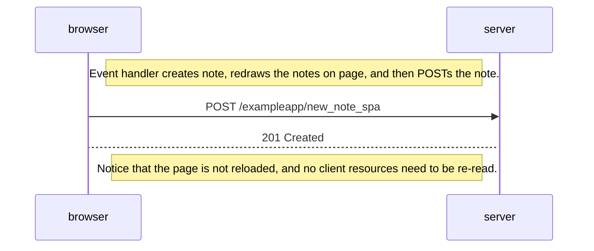

```mermaid
sequenceDiagram
    participant browser
    participant server
    
    note right of browser: Event handler creates note, redraws the notes on page, and then POSTs the note.
    browser->>server: POST /exampleapp/new_note_spa
    activate server
    server-->browser: 201 Created
    note left of server: Notice that the page is not reloaded, and no client resources need to be re-read.
```