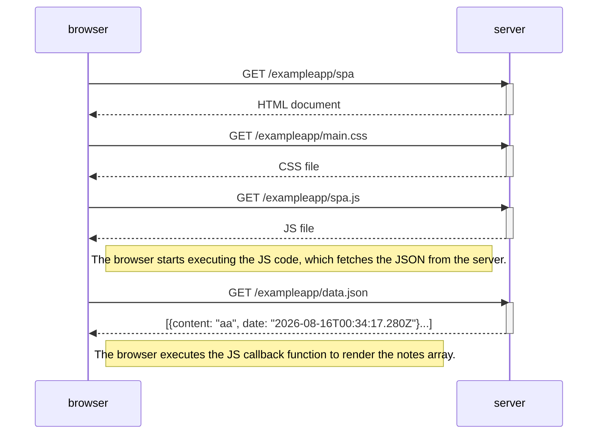

```mermaid
sequenceDiagram
    participant browser
    participant server
    
    browser->>server: GET /exampleapp/spa
    activate server
    server-->>browser: HTML document
    deactivate server
    
    browser->>server: GET /exampleapp/main.css
    activate server
    server-->>browser: CSS file
    deactivate server
    
    browser->>server: GET /exampleapp/spa.js
    activate server
    server-->>browser: JS file
    deactivate server
    note right of browser: The browser starts executing the JS code, which fetches the JSON from the server. 
    
    browser->>server: GET /exampleapp/data.json
    activate server
    server-->>browser: [{content: "aa", date: "2026-08-16T00:34:17.280Z"}...]
    deactivate server
    note right of browser: The browser executes the JS callback function to render the notes array.
    
```